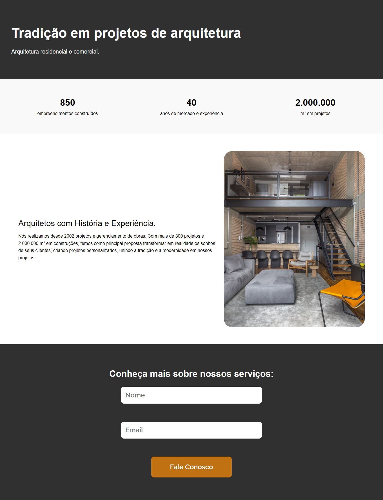

# Landing Page - Projeto Responsivo

Este é um projeto de uma **Landing Page moderna e responsiva**, desenvolvido com **HTML**, **CSS** e **JavaScript**, inspirado em um layout criado no **Figma**. O formulário de contato está integrado ao **SheetMonkey**, permitindo armazenar os dados submetidos diretamente em uma planilha online.

## 🔍 Funcionalidades

- Design responsivo.
- Formulário de contato com campos de nome e e-mail.
- Layout alinhado visualmente ao protótipo original do Figma.
-  Integração com [SheetMonkey](https://sheetmonkey.io) para salvar os dados do formulário.

## 📸 Captura de Tela

## 🛠 Tecnologias Utilizadas

- HTML5
- CSS3  
- JavaScript

## Deploy no netlify
- https://ladingpagearquitecto.netlify.app
## Link da planilha
https://docs.google.com/spreadsheets/d/1e6o-_Ofq0NNrWv_KZzLaZHPyIk38pZ0geLXfgS_x0NA
